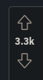

# Rating Extension - Plugin Task

## Information
The Plugin helps others to see whether ratings are helpful and not.

 
Example: <a href="https://reddit.com/">Reddit.com</a>

## System
- [ ] Shopware Demo Shop
- [ ] Template for all new html code
- [ ] Subscriber to send all data to the frontend
- [ ] Controller to handle requests
- [ ] Models for the table (Only one table required)
-----
### Table structure

| <i>Table column</i> | <i>Type</i> |
|---------------------|-------------|
| id                  | int         |
| article_vote_id     | int         |
| customer_id         | int         |
| up                  | boolean     |

----
## Code
- [ ] Arrow up image
- [ ] Arrow down image
----
## User can:
- [ ] up-vote
- [ ] down-vote
- [ ] remove up-vote
- [ ] remove down-vote
------
- [ ] The user has to be logged-In
- [ ] The user can't rate their own rating
